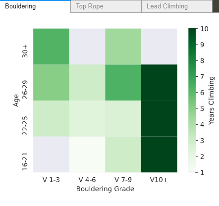

# Climbing-Disciplines - Data Vis Project


## Table of Contents 
* [General Info and Setup](#general-info-and-setup)
* [Technologies](#technologies)
* [To-do](#to-do)
* [Credits](#credits)


## General Info and Setup
This notebook file contains the code for my first project, an interactive data visualization heatmap in Seaborn done through Jupyter Notebooks with ipywidgets.

The goal of the project was to get a hands on experience with data vis in python, and I ended up choosing the Seaborn library to visualize my data as I wanted to take a learn as you go approach with it. 

The data I was working with was obtained through crowd sourcing my data, primarily from close friends and friends of friends through a social media survey, which ended up getting  a lot more than I was expecting! After retrieving the data, I had to "clean"/ try to quantify it better to make it more visually appealing for such a smaller sample size. 

This chart showcases a very brief relationship between years climbing and grades in three different climbing disciplines (bouldering,top rope, and lead climbing) from a n=25, of climbers. 

_For setup, run CLIMBING.ipynb locally through a Jupyter notebook with the three CSV files and Seaborn installed_
```sh
pip install seaborn
```

## Technologies
Jupyter Notebook - Used to display and run the heatmaps

Ipywidgets - Interactive display, containing the different heatmaps for bouldering, toprope and lead through an accordian style widget.

Seaborn is a **required library to be able to run this project**, as it was the main library used and responsible for the heatmaps.

## To-do
- [x] Consolidate the seperate functions (bouldering, toprope, leadclimb)
- [ ] Create poetry project for simpler installation
- [ ] Consolidate CSV files to a singular (dataframe?dictionary?)


## To-do
- [ ] Consolidate the seperate functions (bouldering, toprope, leadclimb)

- [ ] Consolidate CSV files to a singular (dataframe?dictionary?)


## Credits 
Big big shoutout to @bhernandev for helping me with working through the ipywidgets documentation, and for [Schubert's](https://www.kaggle.com/spitfire2nd/enthusiast-to-data-professional-what-changes) kaggle notebook, which really inspired me to get my hands dirty with some data visualization and try my hand at an interactive heatmap. 
